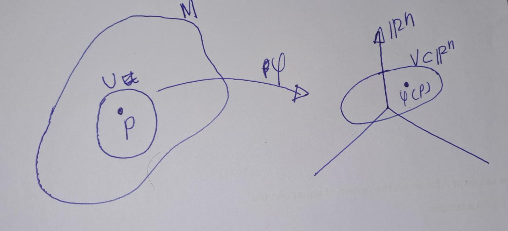

# Manifolds

## Topological Manifolds
```{definition,label='topmanifold'}

Let $(M,\mathcal{T})$ be a topological space with topology $\mathcal{T}$. Then $M$ is called an $n$-dimensional topological manifold, if the following holds:

- **(TM1)**: $M$ is Hausdorff.
- **(TM2)**: The topology of $M$ has a countable basis.
- **(TM3)**: $M$ is locally homeomorphic to $\mathbb{R}^n$, that is, for all $p \in M$ exists an open subset $U \subset M$ with $p \in U$, an open subset $V \subset \mathbb{R}^n$ and a homeomorphism $\varphi : U \rightarrow V$.

```

```{r echo=FALSE,fig.cap='$~$',label='fig01'}
   
```

```{remark}
The first two conditions in the definition \@ref(def:topmanifold) are more of a technical nature and are sometimes neglected. The important fact is that a topological manifold is locally homeomorphic to $\mathbb{R}^n$. Loosely speaking, manifolds look locally like Euclidean space. If the topology on $M$ is induced by a metric, then the first condition is satisfied automatically. If $M$ is given as a subset of $\mathbb{R}^N$ with the subset topology, then both conditions M1 and M2 are satisfied automatically.
```

Let's see some examples.

```{example}
Euclidean space $M=\mathbb{R}^n$ itself is an $n$-dimensional topological manifold:
  
-  (TM1): We know that $\mathbb{R}^n$ is metrc space. Let's say the metric as $d$. Let $x,y\in \mathcal{R}^n$ with $x\neq y$. 
Let $r=d(x,y)$. Since $x\neq y$,$r>0$.
Let $U_x=B(x,r/2)$ and $U_y=B(y,r/2)$. 
So, $x\in U_x$ and $y\in U_y$ We need to show that $U_x \cap U_y\neq \emptyset$. We are going to proof by contrdiction. So, asssume the contray, there exist $z\in U_x\cap U_y$. Thus,
$d(x,z)<r/2$ and $d(y,z)<r/2$. Then,
\[r=d(x,y)\leq d(x,z)+d(z,y)=d(x,z)+d(y,z)<\frac{r}{2}+\frac{r}{2}=r\]
This is contradiction. Hence $U_x\cap U_y \neq \emptyset$. Therefore $M=\mathbb{R}^n$ is Hausdorff.
- (TM2): 
(i), (ii) Obvious.
(iii) Holds true with U = M, V = R
n and x = id.
```
