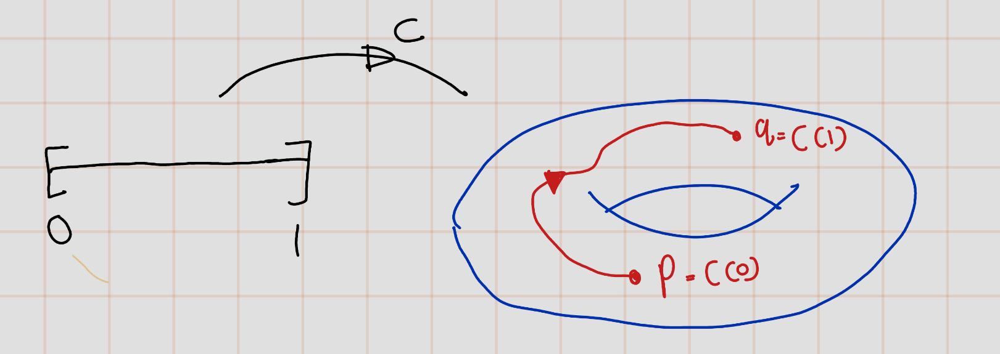

---
output:
  html_document: default
  word_document: default
  pdf_document: default
---

# Manifolds

## Topological Manifolds
```{definition,label='topmanifold'}

Let $(M,\mathcal{T})$ be a topological space with topology $\mathcal{T}$. Then $M$ is called an $n$-dimensional topological manifold, if the following holds:

- **(TM1)**: $M$ is Hausdorff.
- **(TM2)**: The topology of $M$ has a countable basis.
- **(TM3)**: $M$ is locally homeomorphic to $\mathbb{R}^n$, that is, for all $p \in M$ exists an open subset $U \subset M$ with $p \in U$, an open subset $V \subset \mathbb{R}^n$ and a homeomorphism $\varphi : U \rightarrow V$.

```

```{r echo=FALSE,fig.cap='$~$',label='fig02'}
  knitr::include_graphics('figures/ch1/fig02.jpg') 
```

```{remark}
The first two conditions in the definition \@ref(def:topmanifold) are more of a technical nature and are sometimes neglected. The important fact is that a topological manifold is locally homeomorphic to $\mathbb{R}^n$. Loosely speaking, manifolds look locally like Euclidean space. If the topology on $M$ is induced by a metric, then the first condition is satisfied automatically. If $M$ is given as a subset of $\mathbb{R}^N$ with the subset topology, then both conditions M1 and M2 are satisfied automatically.
```

Let's see some examples.

```{example}
Euclidean space $M=\mathbb{R}^n$ itself is an $n$-dimensional topological manifold:
  
-  (TM1): We know that $\mathbb{R}^n$ is metrc space. Let's say the metric as $d$. Let $x,y\in \mathbb{R}^n$ with $x\neq y$. 
Let $r=d(x,y)$. Since $x\neq y$,$r>0$.
Let $U_x=B(x,r/2)$ and $U_y=B(y,r/2)$. 
So, $x\in U_x$ and $y\in U_y$ We need to show that $U_x \cap U_y\neq \emptyset$. We are going to proof by contrdiction. So, asssume the contray, there exist $z\in U_x\cap U_y$. Thus,
$d(x,z)<r/2$ and $d(y,z)<r/2$. Then,
\[r=d(x,y)\leq d(x,z)+d(z,y)=d(x,z)+d(y,z)<\frac{r}{2}+\frac{r}{2}=r\]
This is contradiction. Hence $U_x\cap U_y \neq \emptyset$. Therefore $M=\mathbb{R}^n$ is Hausdorff.
- (TM2): Later I will update this part 

<span style="color:red">Problem **:(**</span>.


- (TM3): Let $U=\mathbb{R}^n=M$ and $V=\mathbb{R}^n$ and $\varphi=id$. We can easily tell that idenntity map is bijective. Furthur, we can observe that inverse of identity map is itself and it is well defined.
So, Let $U'\subset U=\mathbb{R}^n$ be an open set
\[\forall x\in U'\quad id^{-1}(x)=id(x)=x\]. Thus, \[id(U')=id^{-1}(U')=U'.\] Hence, by definition of continuous mapping, $id$ and $id^{-}$ are continuous. 
```

```{example}
Let $M \subset \mathbb{R}^n$ be an open subset. Then $M$ is an $n$-dimensional topological manifold. \
(TM1), (TM2) Obvious. \
(TM3) Holds true with $U = M$, $V = M$ and $x = \text{id}$.

Here Ia m not going to proove this. It is very similar to first example.
```

```{example}
 The standard sphere $M = S^n = \{ \underline{y}=(y^0,...,y^{n}) \in \mathbb{R}^{n+1} : ||\underline{y}|| = 1 \}$ is an $n$-dimensional topological manifold. 

- (TM1) and (TM2) , since $S^n$ is a subset of $\mathbb{R}^{n+1}$.
- (TM3)  We construct two homeomorphisms with the help of the stereographic projection. Let $N$ be north pole of the n-sphere, that is $(\underbrace{0,...,0}_{n~times},1)\in \mathbb{R}^{n+1}$. Let $U_1:=S^n\setminus \{N\}$ and $v_1=\mathbb{R}^{n+1}$. We define

\begin{eqnarray}
\varphi:U_1&\to & V_1\\
\underline{y} =(y^0,y^1,...,y^n) & \mapsto & \frac{(y^0,y^1,...,y^n)}{1-y^{n+1}}
\end{eqnarray}
  - Cliam 1: $varphi$ is injective.\
Let $(x^0,...,x^{n}),(y^0,y^1,...,y^n)\in \mathbb{R}^n$. Suppose that $\varphi(x^0,...,x^{n})=\varphi(y^0,y^1,...,y^n)$.
\begin{eqnarray}
\varphi(x^0,...,x^{n})&=&\varphi(y^0,y^1,...,y^n)\\
\frac{(x^0,x^1,...,x^n)}{1-x^{n+1}}&=&\frac{(y^0,y^1,...,y^n)}{1-y^{n+1}}\\
(y^0, y^1, ..., y^n)(1-x^{n+1}) &=& (x^0, x^1, ..., x^n)(1-y^{n+1})\\
(y^0 - y^0x^{n+1}, y^1 - y^1x^{n+1}, ..., y^n - y^nx^{n+1}) &=& (x^0 - x^0y^{n+1}, x^1 - x^1y^{n+1}, ..., x^n - x^ny^{n+1})\\
y^0(1 - x^{n+1}), y^1(1 - x^{n+1}), ..., y^n (1- y^nx^{n+1}) &=&  x^0(1-y^{n+1}), x^1(1 - y^{n+1}), ..., x^n (1- y^{n+1})\\
\end{eqnarray}
Thus,  $y^i(1 - x^{n+1}) = x^i(1 -y^{n+1})$ for all $i = 0, 1, ..., n$.
 Since $1 - y^{n+1}, 1 - x^{n+1} > 0$, 
 ?

   ?
   
   ?
   
   ?
 
 <span style="color:red">Problem HOW INJECTIVITY COMES**:(**</span>.
  
<span style="color:yellow">CHECK**:(**</span>.                                       
  - Claim 2: $\varphi$ is surejctive.\  
Surjectivity means that for every $\underline{v} \in V_1 = \mathbb{R}^n$, there exists some $\underline{y} \in U_1$ such that $\varphi(\underline{y}) = \underline{v}$.

So, let $\underline{v} = (v^0, v^1, ..., v^n) \in V_1$. We need to find $\underline{y} = (y^0, y^1, ..., y^n) \in U_1$ such that

$$\frac{(y^0, y^1, ..., y^n)}{1-y^{n+1}} = \underline{v}.$$

We can solve this equation for $\underline{y}$ as follows:

$$\underline{y} = (1-y^{n+1})\underline{v} = \underline{v} - y^{n+1}\underline{v}.$$

We know that $\underline{y} \in U_1 = S^n \setminus \{N\}$, so $y^{n+1} = 1 - \|\underline{y}\|^2$. Substituting this into the equation gives us

$$\underline{y} = \underline{v} - (1 - \|\underline{y}\|^2)\underline{v} = \|\underline{y}\|^2\underline{v}.$$

Solving this equation for $\|\underline{y}\|^2$ gives us

$$\|\underline{y}\|^2 = \frac{\|\underline{v}\|^2}{1 + \|\underline{v}\|^2}.$$

Substituting this back into the equation for $\underline{y}$ gives us

$$\underline{y} = \frac{\underline{v}}{1 + \|\underline{v}\|^2}.$$

This is a well-defined point in $U_1$ for every $\underline{v} \in V_1$, so $\varphi$ is surjective.

  - Claim: $\varphi$ is continuous.\
Note that the inverse map $\phi$ is given by,
\begin{eqnarray}
\phi : V_1 &\rightarrow & U_1\\
\underline{x}= (x^0, x^1, ... , x^n) &\mapsto & \frac{(x^0,x^1,...,x^{n-1})}{1 + x^n} 
\end{eqnarray}
<span style="color:yellow">I will update this proof. I want some to to write rigirs proof**:(**</span>.
  
  
  
Analogously, we define the homeomorphism, which omits the south pole:
Let now $U_2 := S^n \setminus \{S\}$ with $S := ( 0,... , 0, -1) \in \mathbb{R}^{n+1}$ and $V_2 := \mathbb{R}^n$.
Then
\begin{eqnarray}
\varphi : U_2 &\rightarrow & V_2,\\
\underline{y}= (y^0, y^1, ... , y^n) &\mapsto & \frac{(y^0,y^1,...,y^n)}{1 + y^n} 
\end{eqnarray}

Therefore,  $n$-sphere $S^n$ is an $n$-dimensional topological manifold.
```

```{example,name='Non-Example'} 
We consider $M := \{ (y^1, y^2, y^3) \in \mathbb{R}^3 | (y^1)^2 = (y^2)^2 + (y^3)^2 \}$, the double cone.

Since $M \subset \mathbb{R}^3$, both (i) and (ii) are satisfied.

But $M$ is **not** a 2-dimensional manifold. Assume  it were, then there would exist an open subset $U \subset M$ with $0 \in U$, an open subset $V \subset \mathbb{R}^2$ and a homeomorphism $\varphi : U \rightarrow V$ with $\varphi(0) = 0$.
<span style="color:red">How do we Gruntee that such hormouphsim exsist that maps 0 to 0**:(**</span>
                                                                      Without losss of generality assume $V = B_r(x(0))$ with $r > 0$. Choose $(p^1,p^2,p^3), (q^1,q^2,q^3) \in U$ with $p^1 > 0$ and $q^1 < 0$. Furthermore, choose a continuous path $c : [0, 1] \rightarrow V$ with $c(0) = x(q_1)$, $c(1) = x(q_2)$ and $c(t) \neq x(0)$ for all $t \in [0, 1]$.

Define the continuous path $\tilde{c} := x^{-1} \circ c : [0, 1] \rightarrow U$. Then $\tilde{c}(0) = q_1$, $\tilde{c}(1) = q_2$, that is, we have $\tilde{c}_1(0) > 0$ while $\tilde{c}_1(1) < 0$. Applying the mean value theorem we find, that there exists a $t \in (0, 1)$ with $\tilde{c}_1(t) = 0$. Then $\tilde{c}(t) = (0, 0, 0)$ and consequently $c(t) = x(\tilde{c}(t)) = x(0)$, which contradicts the choice of $c$. Hence, $M$ is not a 2-dimensional topological manifold.
                     
                                                                                             
```

```{definition,name='charts'}
If $M$ is an $n$-dimensional topological manifold, the homeomorphisms $\varphi : U \to V$ are called charts (or local coordinate systems) of $M$.
```
```{r echo=FALSE,fig.cap='$~$',label='fig06'}
  knitr::include_graphics('figures/ch1/fig06.jpg') 
```
After choosing a local coordinate system $\varphi : U \rightarrow V$ every point $p \in U$ is uniquely characterized by its coordinates $(\varphi^1(p), \ldots , \varphi^n(p))$.

```{example,name='0-dimesional manifold'}
In a $0$-dimensional manifold $M$ every point $p \in M$ has an open neighborhood $U$, which is homeomorphic to $R^0 = \{0\}$. Consequently $\{p\} = U$ is an open subset of $M$ for all
$p \in M$, that is, $M$ carries the discrete topology. Since there exists a countable basis for the topology on $M$ and the topology is discrete in addition, $M$ has to be countable itself.
```

```{r echo=FALSE,fig.cap='$~$',label='fig07'}
   
```

```{proposition}
A topological space $M$ is a 0-dimensional topological manifold, if and only if $M$ is countable and carries the discrete topology.
```

```{proof}
- ($\implies$) By definition, a 0-dimensional topological manifold is a topological space where every point has a neighborhood homeomorphic to the 0-dimensional Euclidean space, which is a single point $\{0\}$. This implies that for every point $p \in M$, there exists an open neighborhood $U$ such that $\{p\} = U$. This is exactly the definition of a discrete topology.

   Since, there exists a countable basis for the topology on $M$, and every point in $M$ is an open set (i.e., the topology is discrete), then $M$ must be countable. This is because every point in $M$ corresponds to an open set in the basis, and since the basis is countable, $M$ must also be countable.
   
- ($\Longleftarrow$) If $M$ carries the discrete topology, then every subset of $M$ is open. In particular, for every point $p \in M$, the set $\{p\}$ is an open set. This means that every point in $M$ has a neighborhood homeomorphic to the 0-dimensional Euclidean space, which is a single point $\{0\}$. This is exactly the definition of a 0-dimensional topological manifold.

   If $M$ is countable, then there exists a countable basis for the topology on $M$. Since every point in $M$ is an open set (i.e., the topology is discrete), this basis can be taken to be the set of all singletons $\{p\}$, where $p \in M$.

Therefore, a topological space $M$ is a 0-dimensional topological manifold if and only if $M$ is countable and carries the discrete topology.

```


```{definition}
A topological manifold $M$ is said to be **connected**, if for every two points $p, q \in M$ there exists a continuous map $c : [0, 1] \to M$ with $c(0) = p$ and $c(1) = q$.
```


```{r echo=FALSE,fig.cap='$~$',label='fig08'}
   
```

Given two points, there has to be a continuous curve in $M$ which connects both. Usually, in Topology one calls this path-connected, which is in the case of manifolds equivalent to being connected. We do not want to go deeper into this subject at this point.


