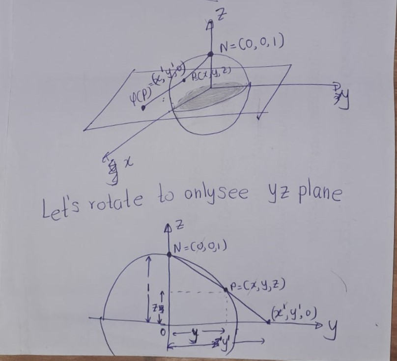

# (APPENDIX) Appendix {-} 
# Stereographic Projection

- **Stereographic Projection plane $\mathbb{R}$ and the 1-sphere minus a point**\
The 1-sphere $S^1$ is the set of points $(x,y,z) \in \mathbb{R}^3$ such that $x^2 + y^2 + z^2 = 1$.
\[S^1:=\{(x,y): ||(x,y)||=1\}\]

Let $S^1 \setminus \{N\}$ denote the 1-sphere minus (circle) its north pole, i.e., the point $(0,1)$.

There exists a homeomorphism $\varphi : S^1 \setminus \{N\} \to \mathbb{R}$, which can be described as follows. In coordinates, this map is precisely
\[\varphi(x,y) = \frac{x}{1-y}\]


```{r echo=FALSE,fig.cap='$~$',label='fig05'}
  knitr::include_graphics('figures/ch1/fig05.jpg') 
```
- **Stereographic Projection plane $\mathbb{R}^2$ and the 2-sphere minus a point**\

Stereographic projection is an important homeomorphism between the plane $\mathbb{R}^2$ and the 2-sphere minus a point. The 2-sphere $S^2$ is the set of points $(x,y,z) \in \mathbb{R}^3$ such that $x^2 + y^2 + z^2 = 1$. Let $S^2 \setminus \{N\}$ denote the 2-sphere minus its north pole, i.e., the point $(0,0,1)$.

There exists a homeomorphism $\varphi : S^2 \setminus \{N\} \to \mathbb{R}^2$, which can be described as follows. 

For a point $p \in S^2 \setminus \{N\}$, let $\varphi(p)$ denote the unique point in $P$ such that the intersection of the segment $\overline{Nf(p)}$ and $S^2$ is $p$. In coordinates, this map is precisely
\[\varphi(x,y,z) = \left(\frac{x}{1-z}, \frac{y}{1-z}\right).\]

```{r echo=FALSE,fig.cap='$~$',label='fig03'}
   
```

```{r echo=FALSE,fig.cap='$~$',label='fig04'}
  knitr::include_graphics('figures/ch1/fig04.jpg') 
```

# Examples of Affine maps


```{r echo=FALSE,fig.cap='$~$',label='fige01'}
   
```

```{r echo=FALSE,fig.cap='$~$',label='fige02'}
   
```

```{r echo=FALSE,fig.cap='$~$',label='fige04'}
   
```

```{r echo=FALSE,fig.cap='$~$',label='fige03'}
   
```