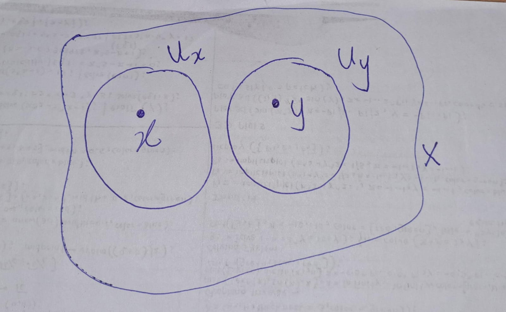
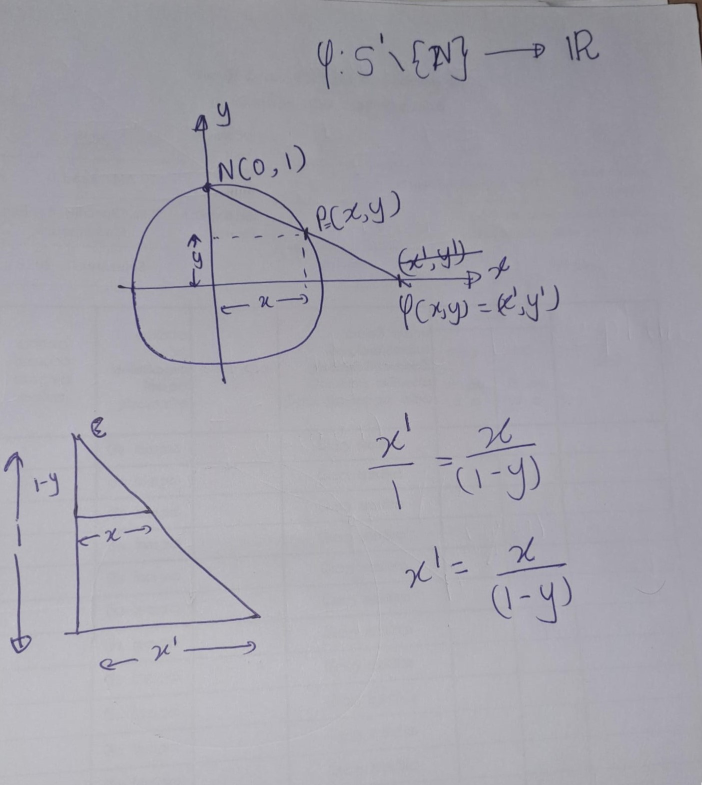
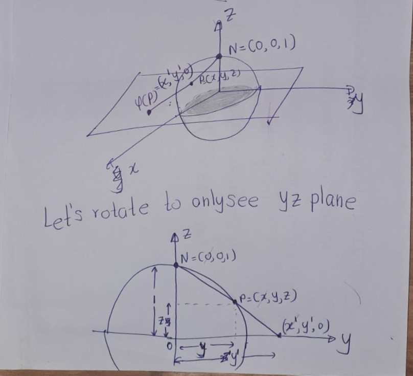
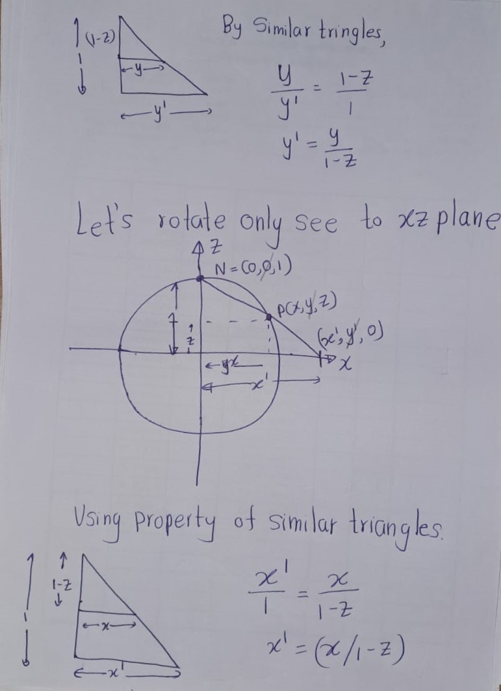

--- 
title: "Manifolds"
author: "Ashan Jayamal & Nalamudu Samarasinghe"
date: "`r Sys.Date()`"
site: bookdown::bookdown_site
documentclass: book
bibliography: [book.bib, packages.bib]
url: https://ashanjayamal.github.io/Manifolds/manifolds.html#topological-manifolds
cover-image: figures/ch1/fig01.jpg
description: |
  Lecture note ongoing seminar Manifolds
link-citations: yes
github-repo: rstudio/bookdown-demo
---


# Basic Theroms and Definitions

```{definition,label="Top",name='Topology'}
A topology on a set $X$ is a collection $\mathcal{T}$ of subsets of $X$ such that

**(T1)** $\phi$ and $X$ are in $\mathcal{T}$;

**(T2)** Any union of subsets in $\mathcal{T}$ is in $\mathcal{T}$;

**(T3)** The finite intersection of subsets in $\mathcal{T}$ is in $\mathcal{T}$.

```
A set $X$ with a topology $\mathcal{T}$ is called a topological space. Denoted by $(X,\mathcal{T})$. An element of $\mathcal{T}$ is called an open set.

```{definition}
A subset $U \subset M$ is referred to as open in $M$ if $U \in \mathcal{T}$. A subset $A \subset M$ is termed closed if $M \setminus A \in \mathcal{T}$.
```

```{definition,name='Continuity'}
If both $(M, \mathcal{T}_M)$ and $(N, \mathcal{T}_N)$ are topological spaces, a map $f : M \rightarrow N$ is termed continuous if \[f^{-1}(V) \in \mathcal{T}_M \text{ for all } V \in \mathcal{T}_N\].
In other words, the preimages of open sets must be open.
```

```{definition,name='Homemorphism'}
A map $f : M \rightarrow N$ between two topological spaces is called homemorphism if it has following propoties.
- $f$ is a bijection,
- $f$ is continuous,
- the inverse function $f^{-1}$ is continuous.

Two topological spaces $M$ and $N$ are called homeomorphic if there exists a homeomorphism between them.
```

```{definition,name='Hausdorff Space'}
A topological space $(X,\mathcal{T})$ is called a Hausdorff space if \
**(H1)** $\forall x,y \in X$ such that $x \neq y$, $\exists U_x, U_y \in \mathcal{T}$ such that $x \in U_x$, $y \in U_y$, and $U_x \cap U_y = \emptyset$.

i.e., for every pair of distinct points $x, y$ in $X$, there are disjoint neighborhoods $U_x$ and $U_y$ of $x$ and $y$ respectively.
```

```{r echo=FALSE,fig.cap='$~$',label='fig01'}
   
```
```{definition,name='Countability'}
A space $X$ is said to have a **countable basis at the point $x$** if there is a countable collection $\{U_n\}_{n\in\mathbb{Z}^+}$ of neighborhoods of $x$ such that any neighborhood $U$ of $x$ contains at least one of the sets $U_n$. A space $X$ that has a countable basis at each of its points is said to satisfy the first countability axiom.
```

###  Stereographic Projection

- **Stereographic Projection plane $\mathbb{R}$ and the 1-sphere minus a point**\
The 1-sphere $S^1$ is the set of points $(x,y,z) \in \mathbb{R}^3$ such that $x^2 + y^2 + z^2 = 1$.
\[S^1:=\{(x,y): ||(x,y)||=1\}\]

Let $S^1 \setminus \{N\}$ denote the 1-sphere minus (circle) its north pole, i.e., the point $(0,1)$.

There exists a homeomorphism $\varphi : S^1 \setminus \{N\} \to \mathbb{R}$, which can be described as follows. In coordinates, this map is precisely
\[\varphi(x,y) = \frac{x}{1-y}\]


```{r echo=FALSE,fig.cap='$~$',label='fig05'}
   
```
- **Stereographic Projection plane $\mathbb{R}^2$ and the 2-sphere minus a point**\

Stereographic projection is an important homeomorphism between the plane $\mathbb{R}^2$ and the 2-sphere minus a point. The 2-sphere $S^2$ is the set of points $(x,y,z) \in \mathbb{R}^3$ such that $x^2 + y^2 + z^2 = 1$. Let $S^2 \setminus \{N\}$ denote the 2-sphere minus its north pole, i.e., the point $(0,0,1)$.

There exists a homeomorphism $\varphi : S^2 \setminus \{N\} \to \mathbb{R}^2$, which can be described as follows. 

For a point $p \in S^2 \setminus \{N\}$, let $\varphi(p)$ denote the unique point in $P$ such that the intersection of the segment $\overline{Nf(p)}$ and $S^2$ is $p$. In coordinates, this map is precisely
\[\varphi(x,y,z) = \left(\frac{x}{1-z}, \frac{y}{1-z}\right).\]

```{r echo=FALSE,fig.cap='$~$',label='fig03'}
   
```

```{r echo=FALSE,fig.cap='$~$',label='fig04'}
   
```

```{definition}
If $X$ is a space, a point $x$ of $X$ is said to be an **isolated point** of $X$ if the one-point set $\{x\}$ is open in $X$.
```
